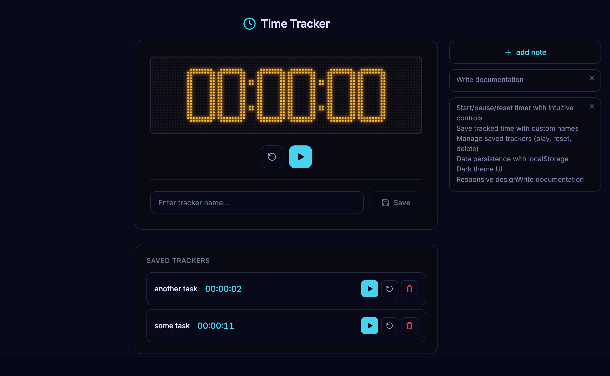

# Time Tracker

A minimalist time tracking application built with React and TypeScript.



## Features

- Start/pause/reset timer with intuitive controls
- Save tracked time with custom names
- Manage saved trackers (play, reset, delete)
- Data persistence with localStorage
- Dark theme UI
- Responsive design

## Tech Stack

- **React 19** - UI framework
- **TypeScript** - Type safety
- **Vite** - Build tool
- **Zustand** - State management
- **Vitest** - Testing framework
- **CSS Modules** - Scoped styling

## Installation

```bash
npm install
```

## Development

```bash
npm run dev
```

## Build

```bash
npm run build
```

## Testing

```bash
# Run tests once
npm test -- --run

# Watch mode
npm test

# UI mode
npm run test:ui

# Coverage
npm run test:coverage
```

See [tests/README.md](tests/README.md) for more details.

## Deploy to GitHub Pages

```bash
npm run deploy
```

## License

MIT
